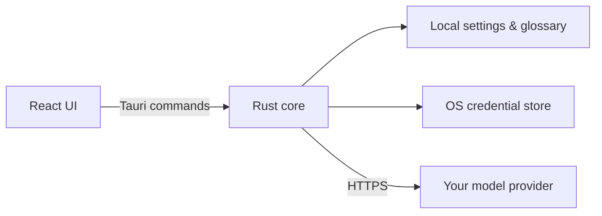

<p align="center">
  
</p>

<h1 align="center">Trali</h1>

<p align="center">
  A lightweight desktop AI translator and grammar checker with custom providers.
</p>

<p align="center">
  <a href="./README.md">English</a> · <a href="./README.zh-CN.md">简体中文</a>
</p>

<p align="center">
  <a href="https://github.com/StereoApp/trali/releases">Windows</a>
  ·
  <a href="https://github.com/StereoApp/trali/releases">macOS</a>
  ·
  <a href="https://github.com/StereoApp/trali/releases">Linux</a>
</p>

---

## What it is

Trali is a **lightweight desktop AI translator and writing assistant**. You bring your own model provider, pick a style, and get streaming results — without a bloated chat suite, accounts, or ads.

It is built for everyday work: messages, email, and technical docs. Open it with a shortcut, type, get a result, close the window. It stays in the tray until you need it again.

---

## Why I built it

In day-to-day work I talk to different people in different places: teammates, managers, external clients, and readers of technical docs. The same idea often needs a different voice — short IM replies, careful email, or precise documentation.

I wanted a tool that could switch those styles freely. What I found instead were apps that were easy to dislike:

- Installers that balloon past 100MB and take forever to start
- Expensive subscriptions in a world where AI tokens are already cheap
- “Custom provider” support that is closed source — so I could not tell how my API key was stored
- Style prompts that were hard or impossible to own
- Ads, lock-in, or rough UI

I never found something that fit. So I built Trali.

---

## Features

1. **Extremely lightweight**  
   No promotions, no account wall. The app starts quickly; translation speed is entirely up to the model you choose.

2. **A UI I am willing to look at**  
   I am picky about interfaces. Trali is carefully polished, with options for theme, color, corner radius, shortcuts, close-to-tray, and more.

3. **Terminology that stays consistent**  
   Glossary support matters when you talk to clients. The same product name or concept should not become a different word every time.

4. **Grammar and expression help**  
   Beyond translation, there is a proofreading mode for when you are writing yourself and want grammar and phrasing suggestions.

5. **Free-form styles**  
   Define styles for different audiences — IM, email, technical writing, and anything else. AI can help refine a style prompt from a few clues and short questions.

6. **Cross-platform, with portable settings**  
   Windows, macOS, and Linux. Export and import settings and terminology so the same tool travels with you across machines. API keys stay on each device and are not included in exports.

7. **API keys stay local**  
   Keys are stored in the operating system credential store, encrypted by the OS. Trali does not upload them anywhere. Requests go from your machine to the provider you configure.

**Also included:** streaming results, multiple styles in parallel, saved language pairs with quick swap, global shortcut and tray, text-to-speech on Windows and macOS, and UI languages including English, 简体中文, 繁體中文, 日本語, 한국어, Español, Deutsch, Français, Português (Brasil), and Русский.

---

## Download

Installers are on **[GitHub Releases](https://github.com/StereoApp/trali/releases)**:

| Platform | Packages |
|----------|----------|
| Windows | MSI, NSIS `.exe` |
| macOS | Apple Silicon and Intel `.dmg` |
| Linux | `.AppImage`, `.deb`, `.rpm` |

You need your own API key and network access to the provider you choose.

### First run

1. Open **Settings → Providers**
2. Add an **OpenAI-compatible** or **Anthropic-compatible** provider
3. Fill in endpoint, model, and API key
4. Test the connection and set it as default
5. Type on the main screen to translate, or switch mode for proofreading

Custom base URLs are supported, so official APIs and compatible gateways both work.

---

## Architecture

Trali is a small desktop app: the UI is web tech; privileged work stays in Rust.



| Layer | Stack |
|-------|--------|
| Desktop shell | Tauri 2 |
| Native core | Rust, Tokio, streaming HTTP |
| UI | React 19, TypeScript, Vite, Tailwind CSS, Base UI / shadcn |
| Config | TOML settings, CSV glossary |
| Secrets | OS credential store (`keyring`) |

The frontend never talks to providers with your key directly. Generation streams from Rust; several styles can run in parallel; when input changes, outdated requests are cancelled so stale text does not overwrite new results.

---

## Privacy & security

- No Trali account and no Trali API relay
- API keys live only in the OS credential store (e.g. Windows Credential Manager, macOS Keychain)
- Keys are not written to `settings.toml`
- Settings export never includes keys
- Network traffic is from your device to the provider you configured
- How that provider handles your text is still governed by their privacy policy

---

## Develop from source

Requirements:

- [Node.js](https://nodejs.org/) 20+
- [pnpm](https://pnpm.io/)
- [Rust stable](https://www.rust-lang.org/tools/install)
- Platform [Tauri 2 prerequisites](https://v2.tauri.app/start/prerequisites/)

```powershell
pnpm install
pnpm tauri dev
```

Frontend only (no tray, global shortcut, credential store, or system speech):

```powershell
pnpm dev
```

Build the production frontend or desktop bundles with `pnpm build` and `pnpm tauri build`.

---

## Community

Trali is primarily a tool for my own workflow, but I am happy if it helps others too.

- Open an issue if something is broken or missing
- Pull requests are welcome — keep them focused and consistent with the existing code
- If you like the project, a star is appreciated

---

应用更新使用 Tauri 官方 updater，并从 GitHub Release 的 `latest.json` 获取版本信息。首次启用发布更新前，需要生成一对 updater 签名密钥，将公钥保留在 `src-tauri/tauri.conf.json`，并把私钥内容保存为 GitHub 仓库 Secret：`TAURI_SIGNING_PRIVATE_KEY`。

```powershell
pnpm tauri signer generate -w "$HOME/.tauri/trali.key"
```

之后推送新的 `v*` 标签，GitHub Actions 会上传签名更新产物和 `latest.json`。不要将私钥提交到仓库。

## License

[GNU General Public License v3.0](./LICENSE) (GPLv3).

---

<sub>Most of the implementation was produced with AI coding tools. Product concept, design decisions, and code review are done by the author.</sub>
