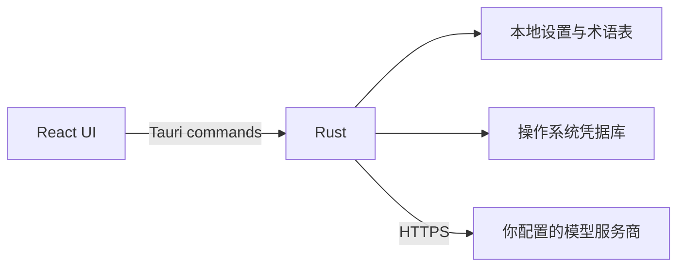

<p align="center">
  
</p>

<h1 align="center">Trali</h1>

<p align="center">
  一个轻量的桌面 AI 翻译工具。
</p>

<p align="center">
  Windows · macOS · Linux
</p>

---

Trali 是我给自己做的一个小工具。

平时看文档、写邮件或者回消息时，我只想按一下快捷键，输入内容，然后马上拿到翻译结果。我不想打开浏览器，也不想进入一个塞满聊天记录和复杂功能的 AI 工作台。

所以有了 Trali：输入即翻译，结果会流式出现。用完关掉，它继续待在托盘里。

## 它能做什么

- 输入内容后自动翻译，不需要再点一次“发送”
- 在翻译和语法检查之间快速切换
- 保存常用语言对，一键切换源语言和目标语言
- 直接交换原文与译文，不重复请求接口
- 同时生成多个风格的译文，方便比较
- 用术语表固定人名、产品名和专业词汇
- 朗读译文（Windows / macOS）
- 全局快捷键呼出、窗口置顶、关闭到托盘
- 跟随系统深浅色，也可以自己选择主题色和圆角

目前支持 English、简体中文、繁體中文、日本語、한국어、Español、Deutsch、Français、Português (Brasil) 和 Русский。

## Key 放在哪里？

这是我很在意的一件事。

Trali 没有账号系统，也没有自己的 API 中转服务。你的 Key 只保存在本机的操作系统凭据库里，由系统负责加密和访问控制。

- Key 不会写进 `settings.toml`
- 导出设置时不会带上 Key
- Trali 不会把 Key 上传到自己的服务器
- 请求会从你的电脑直接发给你配置的模型服务商

换句话说，Key 平时一直待在本地。只有真正调用模型时，它才会作为认证信息发送给对应的服务商。翻译内容如何被服务商处理，仍取决于该服务商自己的隐私政策。

## 开始使用

第一次打开 Trali，需要先配置一个模型服务商：

1. 进入 **设置 → 服务商**
2. 添加 OpenAI-compatible 或 Anthropic-compatible 服务商
3. 填写 API 地址、模型和 Key
4. 测试连接，并设为默认服务商

回到主界面输入文字，就可以开始翻译了。

Trali 支持自定义 API 地址，所以可以连接官方接口，也可以连接兼容相应协议的服务。

## 本地运行

需要先安装：

- [Node.js](https://nodejs.org/) 20+
- [pnpm](https://pnpm.io/)
- [Rust stable](https://www.rust-lang.org/tools/install)
- 对应平台的 [Tauri 2 前置依赖](https://v2.tauri.app/start/prerequisites/)

然后执行：

```powershell
pnpm install
pnpm tauri dev
```

如果只想看前端界面：

```powershell
pnpm dev
```

浏览器里没有系统凭据库、托盘、全局快捷键和系统语音等原生能力，完整功能请使用 `pnpm tauri dev`。

## 技术实现

Trali 的界面使用 React，原生能力放在 Rust 里。前端不会直接读取 Key，也不会直接访问文件系统。



| 部分 | 使用的技术 |
|---|---|
| 桌面框架 | Tauri 2 |
| 原生层 | Rust、Tokio、reqwest、keyring |
| 前端 | React 19、TypeScript 5.8、Vite 8 |
| UI | Tailwind CSS 4、Base UI、shadcn、Lucide |
| 配置 | TOML |
| 术语表 | CSV |
| 包管理 | pnpm |

模型返回内容由 Rust 后端以流式事件发送给界面。多个翻译风格可以并行请求；输入发生变化时，旧请求会被取消，避免过时结果覆盖新内容。

## 项目结构

```text
├── src/
│   ├── components/        # 界面组件
│   ├── lib/               # i18n、主题和 Tauri API 封装
│   ├── App.tsx
│   └── App.css
├── src-tauri/
│   ├── src/
│   │   ├── commands.rs    # Tauri commands
│   │   ├── generation.rs  # 流式生成
│   │   ├── providers/     # OpenAI / Anthropic 协议适配
│   │   ├── secrets.rs     # 系统凭据库
│   │   ├── glossary.rs
│   │   ├── settings.rs
│   │   └── speech.rs
│   └── tauri.conf.json
└── package.json
```

## 构建与检查

```powershell
# 前端类型检查与生产构建
pnpm build

# 构建桌面安装包
pnpm tauri build
```

Rust：

```powershell
cargo fmt --manifest-path src-tauri/Cargo.toml --check
cargo check --manifest-path src-tauri/Cargo.toml
cargo test --manifest-path src-tauri/Cargo.toml
```

仓库目前没有单独的前端 `test` 或 `lint` 脚本。

## 数据与配置

Trali 会在 Tauri 的应用配置目录中保存：

- `settings.toml`：服务商、风格和界面偏好，不包含 API Key
- `glossary.csv`：术语表
- 操作系统凭据库条目：各服务商的 API Key

设置和术语表使用原子写入，尽量避免程序意外退出时留下不完整文件。

## 构建产物

[GitHub Actions](./.github/workflows/build.yml) 会构建：

- Windows x64：MSI、NSIS `.exe`
- macOS：Apple Silicon 与 Intel `.dmg`
- Linux x64：`.AppImage`、`.deb`

推送 `v*` 标签会创建一个带安装包的 Draft Release。

应用更新使用 Tauri 官方 updater，并从 GitHub Release 的 `latest.json` 获取版本信息。首次启用发布更新前，需要生成一对 updater 签名密钥，将公钥保留在 `src-tauri/tauri.conf.json`，并把私钥内容保存为 GitHub 仓库 Secret：`TAURI_SIGNING_PRIVATE_KEY`。

```powershell
pnpm tauri signer generate -w "$HOME/.tauri/trali.key"
```

之后推送新的 `v*` 标签，GitHub Actions 会上传签名更新产物和 `latest.json`。不要将私钥提交到仓库。

## License

仓库目前还没有 License 文件。

<sub>This project was developed with assistance from AI coding tools. All changes are reviewed and maintained by the project author.</sub>
